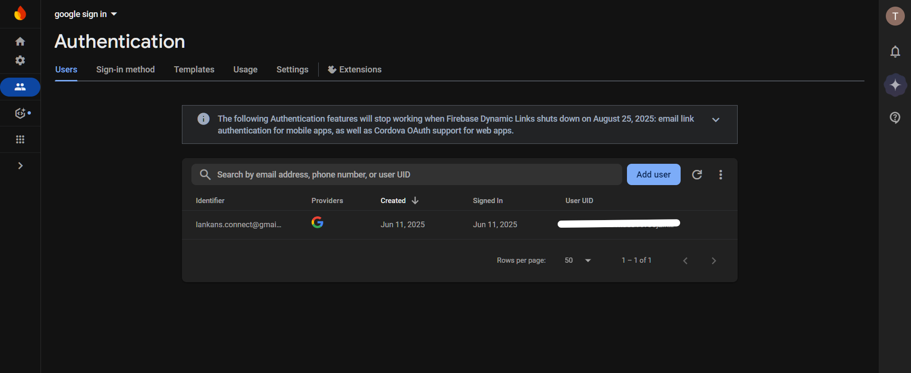
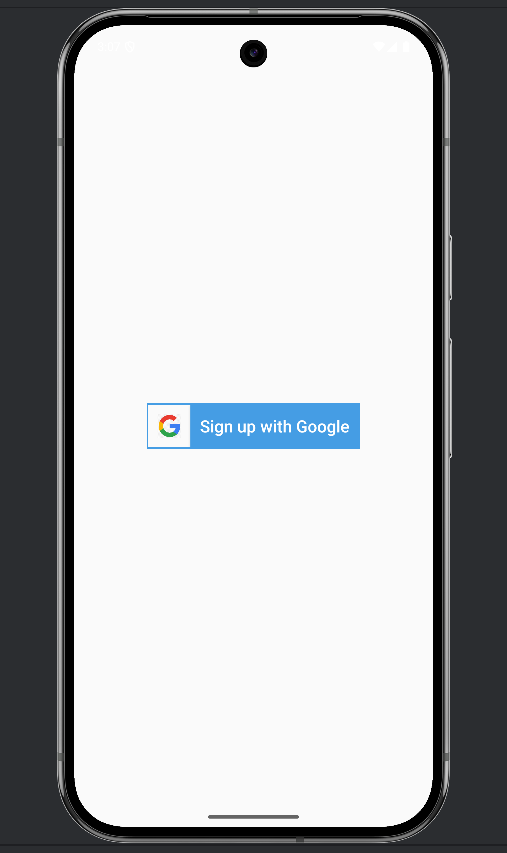
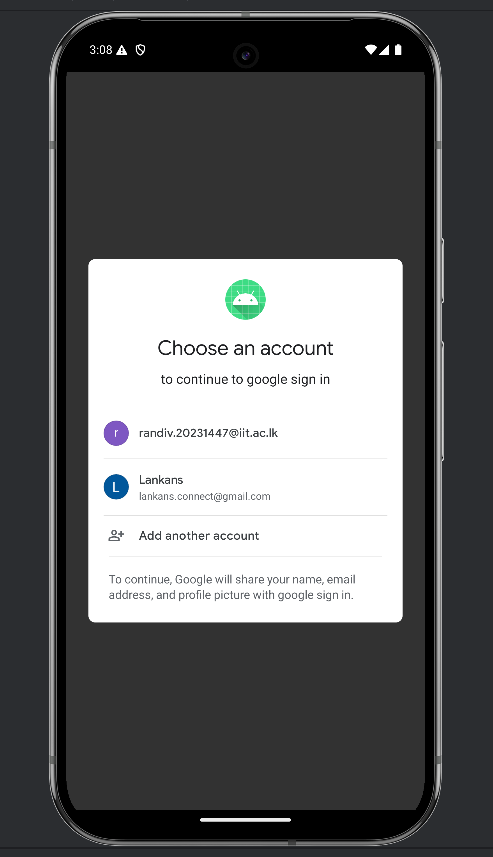
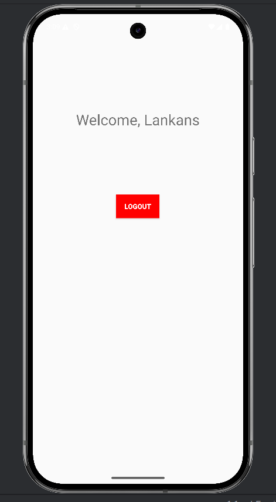

# Google Sign-In with Firebase Authentication (Android - Kotlin)

This Android app demonstrates how to implement **Google Sign-In** authentication using **Firebase Authentication** in Kotlin. Users can securely sign in with their Google accounts, and the app handles authentication and user session management.

---

## Features

- Google Sign-In integration using Firebase Authentication  
- User-friendly sign-in and sign-out flows  
- Display of signed-in user's name on the main screen  
- Secure token-based authentication with Firebase  
- Clean and simple UI using ConstraintLayout and Material design principles  

---

## Screenshots

  
 
    

---

## Getting Started

### Prerequisites

- Android Studio (recommended latest stable version)  
- Firebase account  
- Google account for sign-in testing  
- SHA-1 fingerprint of your debug/release keystore  

    

